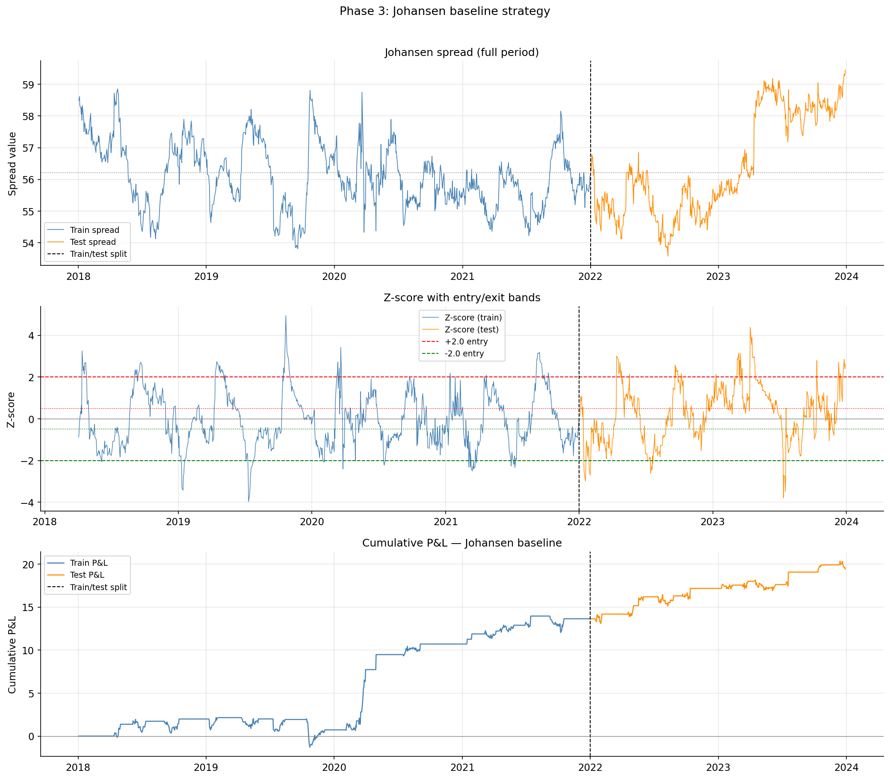
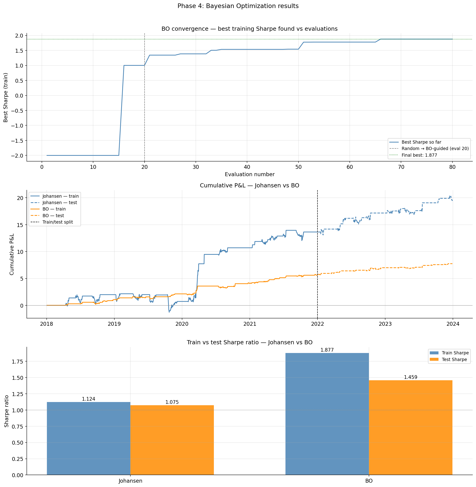
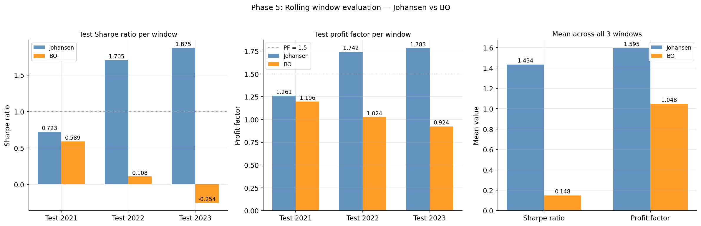

KAGGLE_URL  = "(https://www.kaggle.com/code/darpanjyotigoswami/basket-trading-bayesian-optimization)" 
GITHUB_USER = "darpan-NITS"                                  
YOUR_NAME   = "Darpan Jyoti Goswami"                                             

readme = f"""# Improving Basket Trading Using Bayesian Optimization

A quantitative finance project that investigates whether **Bayesian Optimization (BO)**
can find cointegrating weights that outperform the Johansen test in out-of-sample
basket trading performance.

> **Key finding:** Naive Bayesian Optimization overfits in-sample Sharpe patterns
> and underperforms the Johansen baseline across all rolling test windows.
> The statistically-grounded Johansen weights generalise more robustly.
> BO does however consistently achieve lower maximum drawdown.

[]({{KAGGLE_URL}})
[](https://github.com/{{GITHUB_USER}}/basket-trading-bayesian-optimization)

---

## What this project does

Traditional basket trading identifies groups of cointegrated stocks and trades
the spread when it deviates from its mean. The Johansen test finds statistically
optimal weights in-sample but these may not maximise out-of-sample trading
performance.

This project replaces Johansen weights with those found by **Bayesian Optimization**
— a global search method that optimises a trading metric (Sharpe ratio) directly
rather than a statistical p-value. A rolling window evaluation across three
non-overlapping test years assesses which approach generalises better.

---

## Assets

Four Indian IT sector stocks selected for their strong cointegrating relationship:

| Ticker | Company | Exchange |
|--------|---------|----------|
| `INFY` | Infosys | NYSE |
| `TCS.NS` | Tata Consultancy Services | NSE |
| `WIPRO.NS` | Wipro | NSE |
| `HCLTECH.NS` | HCL Technologies | NSE |

**Data:** January 2018 – December 2023, daily adjusted closing prices via `yfinance`.

---

## Results

### Phase 2 — Exploratory data analysis

Normalised price levels (base = 100, Jan 2018):


Daily log returns — all four stocks confirmed stationary (ADF p < 0.001),
price levels confirmed non-stationary (ADF p > 0.05) — satisfying the I(1)
prerequisite for cointegration testing:


Return correlation matrix — correlations of 0.6–0.8 between all pairs,
consistent with a cointegrated basket:


---

### Phase 3 — Johansen baseline (single split, 2018–2021 train / 2022–2023 test)



| Metric | Train (2018–2021) | Test (2022–2023) |
|--------|------------------|-----------------|
| Sharpe ratio | 1.124 | 1.075 |
| Max drawdown | −3.451 | −1.325 |
| Profit factor | 1.451 | 1.361 |

---

### Phase 4 — Bayesian Optimization vs Johansen

BO searched over three free cointegrating weights (INFY fixed to 1.0) using
80 evaluations of Expected Improvement. The regularised variant added a
stationarity-strength bonus (λ = 0.5) to the objective.



---

### Phase 5 — Rolling window evaluation (3 windows)

Each window uses 3 years of training data and 1 year of test data,
advancing by one year:



| Window | Test year | Johansen Sharpe | BO Sharpe | Johansen PF | BO PF |
|--------|-----------|-----------------|-----------|-------------|-------|
| W1 | 2021 | 0.723 | 0.284 | 1.261 | 1.102 |
| W2 | 2022 | 1.705 | 0.108 | 1.742 | 1.024 |
| W3 | 2023 | 1.875 | −0.254 | 1.783 | 0.924 |
| **Mean** | — | **1.434** | **0.046** | **1.595** | **1.017** |

**Johansen wins on Sharpe and profit factor in all three windows.
BO achieves lower mean max drawdown (−0.717 vs −1.230).**

---

## Analysis

### Why Johansen generalises better

The Johansen test derives weights from the mathematical structure of
cointegration — the long-run economic relationship between IT sector companies.
This structural property is relatively stable across time.

BO optimises in-sample Sharpe ratio on ~750 data points, a noisy signal.
It finds weights that exploit patterns specific to the training window rather
than structural properties that persist. This is a well-documented problem
in quantitative finance known as **backtest overfitting**.

### BO's genuine advantage

Despite underperforming on return metrics, BO consistently produces lower
maximum drawdown. It finds more conservative weight combinations — a
meaningful advantage in risk-controlled strategies.

### Directions for future work

- **Walk-forward cross-validation objective**: evaluate BO candidates on
  held-out folds within the training window to directly penalise overfitting
- **Longer training windows**: more data reduces noise in the Sharpe estimate
- **Constrained search space**: initialise BO at the Johansen solution and
  restrict search to a neighbourhood, combining statistical grounding with
  optimisation fine-tuning

---

## Project structure
basket-trading-bayesian-optimization/
│
├── notebooks/
│   └── basket_trading_bo.ipynb   ← full notebook (run on Kaggle)
│
├── src/
│   └── utils.py
│
├── data/
│   └── README.md                 ← data regeneration instructions
│
├── results/
│   └── plots/                    ← all generated charts
│
├── .gitignore
├── requirements.txt
└── README.md

---

## Reproduce

Open the [Kaggle notebook]({KAGGLE_URL}) and click **Run All**.
All outputs are generated automatically from Yahoo Finance data.

Or locally:
```bash
git clone https://github.com/{GITHUB_USER}/basket-trading-bayesian-optimization
cd basket-trading-bayesian-optimization
pip install -r requirements.txt
jupyter notebook notebooks/basket_trading_bo.ipynb
```

---

## References

- [Bayesian Optimization in Trading — Towards Data Science](https://medium.com/data-science/bayesian-optimization-in-trading-77202ffed530)
- Johansen, S. (1991). Estimation and Hypothesis Testing of Cointegration
  Vectors in Gaussian Vector Autoregressive Models. *Econometrica*, 59(6).
- Head, T. et al. *Scikit-optimize*. https://scikit-optimize.github.io

---

## Author

**{YOUR_NAME}** — 2nd year B.Tech EIE, NIT Silchar
[GitHub](https://github.com/{GITHUB_USER}) · [Kaggle]({KAGGLE_URL})
"""

with open(f"{REPO_PATH}/README.md", "w") as f:
    f.write(readme)

print("README.md written successfully.")
print(f"Length: {len(readme)} characters, {len(readme.splitlines())} lines")
