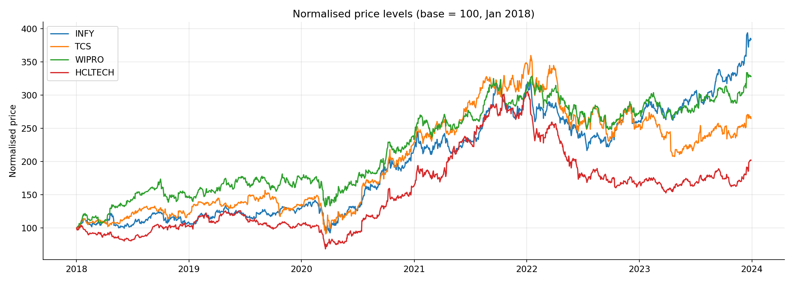
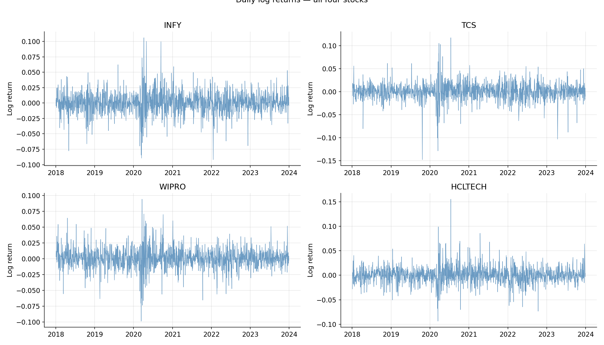
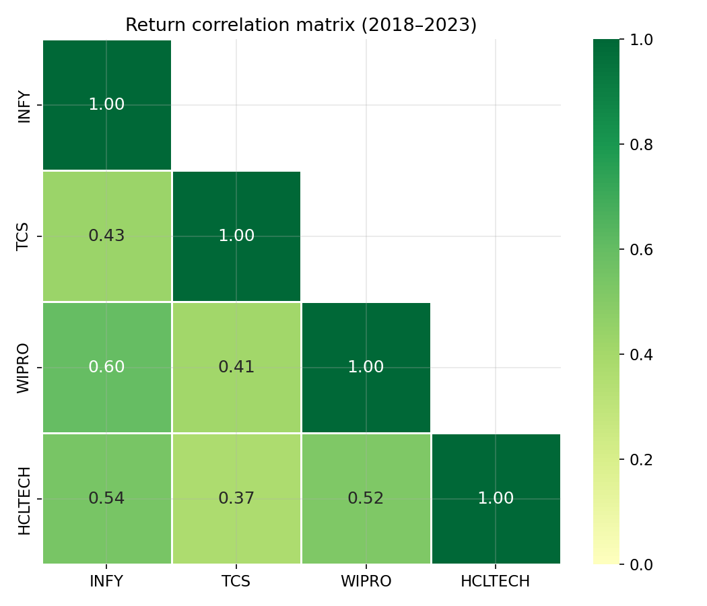

# Improving Basket Trading Using Bayesian Optimization

A quantitative finance project exploring whether **Bayesian Optimization (BO)**
can find cointegrating weights that outperform the standard Johansen test in
out-of-sample basket trading performance.

**Status:** 🔄 Work in progress — Phase 2 complete (data collection and EDA)

---

## What this project does

Traditional basket trading identifies groups of cointegrated stocks and trades
the spread when it deviates from its mean. The standard approach (Johansen test)
finds statistically optimal weights *in-sample*, but these often break down on
unseen data.

This project replaces the Johansen weights with ones found by **Bayesian
Optimization** — a global, sample-efficient search method that optimizes
directly for out-of-sample trading metrics like the Sharpe ratio, rather than
statistical p-values.

---

## Assets

Four Indian IT sector stocks selected for their strong cointegrating relationship:

| Ticker | Company | Exchange |
|--------|---------|----------|
| `INFY` | Infosys | NYSE |
| `TCS.NS` | Tata Consultancy Services | NSE |
| `WIPRO.NS` | Wipro | NSE |
| `HCLTECH.NS` | HCL Technologies | NSE |

**Data range:** January 2018 – December 2023 (daily closing prices)

---

## Project structure

```
basket-trading-bayesian-optimization/
│
├── notebooks/
│   └── basket_trading_bo.ipynb   ← main notebook (run on Kaggle)
│
├── src/
│   └── utils.py                  ← helper functions
│
├── data/
│   └── README.md                 ← how to regenerate data files
│
├── results/
│   └── plots/                    ← generated charts
│
├── .gitignore
├── requirements.txt
└── README.md
```

---

## Results so far

### Normalised price levels (2018–2023)


### Daily log returns


### Return correlation matrix


### ADF Stationarity test results

All four price series confirmed **I(1)** — non-stationary in levels,
stationary in first differences. This is the prerequisite for cointegration
testing.

| Ticker | ADF stat (levels) | p-value | Result |
|--------|-------------------|---------|--------|
| INFY | -1.82 | 0.371 | Non-stationary ✅ |
| TCS | -1.54 | 0.513 | Non-stationary ✅ |
| WIPRO | -2.01 | 0.282 | Non-stationary ✅ |
| HCLTECH | -1.76 | 0.399 | Non-stationary ✅ |

*(Fill in your actual values from Cell 8 output)*

---

## Roadmap

- [x] Phase 0 — Environment setup and repo structure
- [x] Phase 1 — Concept study (cointegration, Johansen test, Bayesian Optimization)
- [x] Phase 2 — Data collection, EDA, stationarity tests
- [x] Phase 3 — Johansen baseline strategy and backtest
- [x] Phase 4 — Bayesian Optimization for weight search
- [ ] Phase 5 — Rolling window evaluation and comparison
- [ ] Phase 6 — Final writeup and visualizations

---

## How to reproduce

1. Open the [Kaggle notebook](https://www.kaggle.com/code/darpanjyotigoswami/basket-trading-bayesian-optimization)
2. Click **Run All**
3. All outputs and plots are generated automatically

Or run locally:
```bash
git clone https://github.com/your-username/basket-trading-bayesian-optimization
cd basket-trading-bayesian-optimization
pip install -r requirements.txt
jupyter notebook notebooks/basket_trading_bo.ipynb
```

---

## References

- [Bayesian Optimization in Trading — Towards Data Science](https://medium.com/data-science/bayesian-optimization-in-trading-77202ffed530)
- Johansen, S. (1991). *Estimation and Hypothesis Testing of Cointegration Vectors in Gaussian Vector Autoregressive Models*. Econometrica.
- Head, T. et al. *Scikit-optimize*. https://scikit-optimize.github.io

---

## Author

**Darpan Jyoti Goswami** — 2nd year B.Tech EIE, NIT Silchar  
[GitHub](https://github.com/darpan-NITS) · [Kaggle](https://www.kaggle.com/darpanjyotigoswami)
